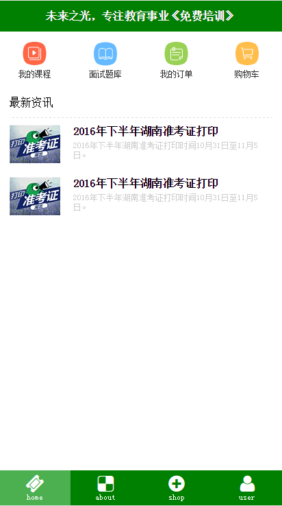
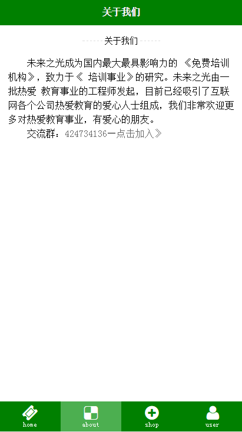
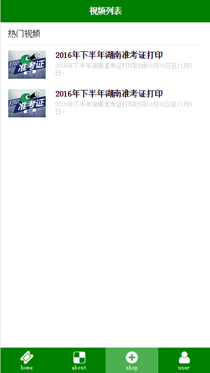
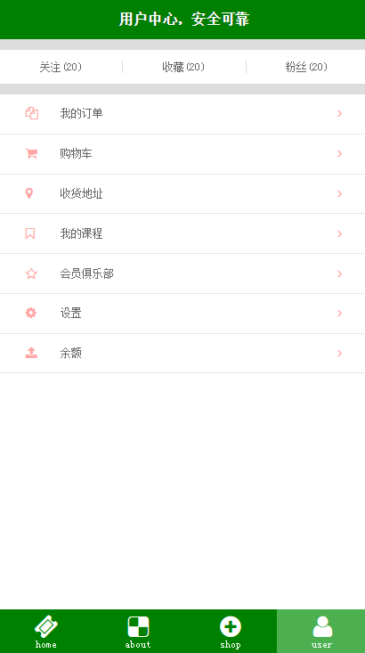

# reactcnode
一.环境：
====================
	1.git工具
	2.nodejs
	3.atom
二.下载：
=======================
    git clone  https://github.com/tjlightfuturedreams/reactcnode.git
三.安装
==================
   1.npm install
   2.在浏览器中输入http://localhost:88/page
四.项目页面展示：
=========================
	1.home
	;
	2.about
	;
	3.shop
	;
	4.user
	;